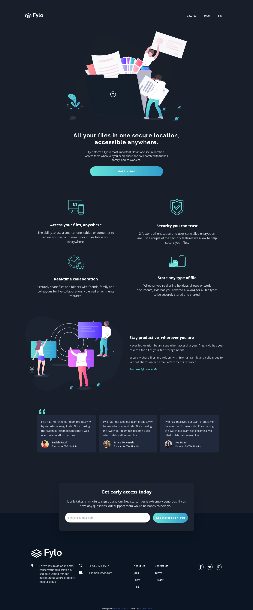
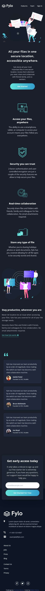

# Frontend Mentor - Fylo dark theme landing page solution

This is a solution to the [Fylo dark theme landing page challenge on Frontend Mentor](https://www.frontendmentor.io/challenges/fylo-dark-theme-landing-page-5ca5f2d21e82137ec91a50fd). Frontend Mentor challenges help you improve your coding skills by building realistic projects. 

## Table of contents

- [Overview](#overview)
  - [The challenge](#the-challenge)
  - [Screenshot](#screenshot)
  - [Links](#links)
- [My process](#my-process)
  - [Built with](#built-with)
  - [What I learned](#what-i-learned)
  - [Continued development](#continued-development)
  - [Useful resources](#useful-resources)
- [Author](#author)
- [Acknowledgments](#acknowledgments)

## Overview

### The challenge

Users should be able to:

- View the optimal layout for the site depending on their device's screen size
- See hover states for all interactive elements on the page

### Screenshot

### Links

- Solution URL: [Click here](https://www.frontendmentor.io/solutions/simple-landing-page-with-tailwind-css-B9y7l5oMn)
- Live Site URL: [Click here](https://robert-otieno.github.io/fylo-dark-theme-landing-page-master/)

## My process

### Built with

- Semantic HTML5 markup
- CSS custom properties
- Flexbox
- CSS Grid
- Mobile-first workflow
- [Tailwindcss](https://tailwindcss.com/) - For styles

### What I learned

I believe my understanding of tailwind has gone a notch higher. 😆💯

### Continued development

More can be added to make this design modern and improve the UI.

### Useful resources

- [Tailwind CSS](https://www.tailwindcss.com) - This helped me with styling... Tailwind is awesome!!! 💰

## Author

- Website - [Robert Otieno](https://robertotieno.rokeservices.com/)
- Frontend Mentor - [@robert-otieno](https://www.frontendmentor.io/profile/robert-otieno)
- LinkedIn - [robert-otieno](https://www.linkedin.com/in/robert-otieno-9b2b42174/)